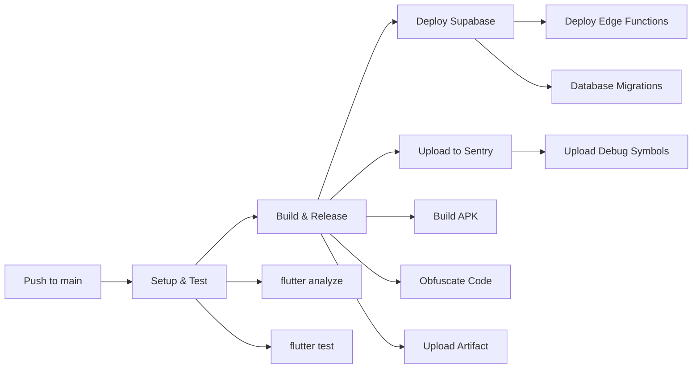

# CI/CD Pipeline Guide

## Overview

This project uses **GitHub Actions** to automatically build, test, and deploy the SMSChat Flutter application. The pipeline integrates with **Supabase** for backend deployment and **Sentry** for crash reporting and performance monitoring.

## Pipeline Architecture



## Pipeline Jobs

### 1. **Setup & Test** (`setup_and_test`)

**Purpose**: Validate code quality before building

**Steps**:
- Checkout code
- Setup Java 17 + Flutter 3.24.0
- Install dependencies (`flutter pub get`)
- Run static analysis (`flutter analyze`)
- Execute unit tests (`flutter test`)

**Duration**: ~2-3 minutes

---

### 2. **Build & Release** (`build_and_release`)

**Purpose**: Generate production APK with obfuscation

**Steps**:
- Build release APK with:
  - `--obfuscate`: Masks your Dart code to prevent reverse engineering
  - `--split-debug-info`: Separates debug symbols for Sentry
- Upload APK as downloadable artifact
- Install Sentry CLI
- Upload debug symbols to Sentry for crash reporting

**Output**: `app-release.apk` (available in GitHub Actions artifacts)

**Duration**: ~5-7 minutes

---

### 3. **Deploy Supabase** (`deploy_supabase`)

**Purpose**: Automatically deploy backend changes

**Steps**:
- Setup Supabase CLI
- Deploy Edge Functions to production
- *(Optional)* Apply database migrations

**Duration**: ~1-2 minutes

---

## Environment Configuration

### 🔐 GitHub Secrets (Required)

You **MUST** configure these secrets in your repository:

**Settings → Secrets and variables → Actions → New repository secret**

| Secret Name | Description | How to Get |
|------------|-------------|------------|
| `SENTRY_AUTH_TOKEN` | Sentry API authentication token | Already configured: `0a9f4d2eca4b11f093d9325d36f7d3c0` |
| `SUPABASE_ACCESS_TOKEN` | Supabase personal access token | [Generate here](https://supabase.com/dashboard/account/tokens) |

### 🌍 Environment Variables (Public)

These are defined in the workflow file and are **not** secret:

```yaml
SUPABASE_PROJECT_ID: oizpvbhqevegxjqimpne
SENTRY_ORG: choukri-group
SENTRY_PROJECT: flutter
```

---

## How to Use the Pipeline

### 🚀 Automatic Deployment

**The pipeline runs automatically when you:**
1. Push commits to the `main` branch
2. Merge a pull request into `main`

**Example**:
```bash
git add .
git commit -m "Add new chat feature"
git push origin main
```

→ GitHub Actions will automatically build and deploy your app!

---

### 🎯 Manual Deployment

**You can also trigger the pipeline manually:**

1. Go to your repository on GitHub
2. Click **Actions** tab
3. Select **Android CI/CD – Flutter + Supabase + Sentry** workflow
4. Click **Run workflow** dropdown
5. Select the `main` branch
6. Click **Run workflow** button

---

## Downloading the APK

After a successful build:

1. Go to **Actions** tab in GitHub
2. Click on the latest workflow run
3. Scroll to **Artifacts** section
4. Download **release-apk**
5. Extract and install `app-release.apk` on your Android device

---

## Viewing Build Results

### ✅ Success

All jobs show green checkmarks → Your app is built and deployed!

### ❌ Failure

Click the failed job to see error logs. Common issues:

| Error | Solution |
|-------|----------|
| `flutter analyze` failed | Fix linting errors in your code |
| `flutter test` failed | Fix failing unit tests |
| Sentry upload failed | Verify `SENTRY_AUTH_TOKEN` is correct |
| Supabase deploy failed | Verify `SUPABASE_ACCESS_TOKEN` is correct |

---

## Sentry Integration

### What Gets Uploaded

- **Debug Symbols**: Allows Sentry to show readable stack traces for crashes
- **Source Maps**: Maps obfuscated code back to original source lines

### Viewing Crashes in Sentry

1. Go to [Sentry Dashboard](https://sentry.io)
2. Select your **choukri-group** organization
3. Open the **flutter** project
4. View crashes with full stack traces (even from obfuscated builds!)

---

## Supabase Deployment

### Edge Functions

The pipeline automatically deploys all functions in `supabase/functions/`:

```
supabase/
└── functions/
    └── proxy_api/
        └── index.ts
```

**Command**: `supabase functions deploy --project-ref oizpvbhqevegxjqimpne`

### Database Migrations (Optional)

**Currently disabled** to prevent accidental schema changes.

**To enable**:
1. Open `.github/workflows/main.yml`
2. Uncomment lines 103-106:
   ```yaml
   - name: Deploy Database Migrations
     env:
       SUPABASE_ACCESS_TOKEN: ${{ secrets.SUPABASE_ACCESS_TOKEN }}
     run: supabase db push --project-ref $SUPABASE_PROJECT_ID
   ```

**⚠️ Warning**: This will apply migrations from `supabase/migrations/` to your **production** database. Always test migrations locally first!

---

## Testing the Pipeline

### First-Time Setup Checklist

- [x] GitHub secrets configured (`SENTRY_AUTH_TOKEN`, `SUPABASE_ACCESS_TOKEN`)
- [ ] Push a test commit to `main`:
  ```bash
  git commit --allow-empty -m "Test CI/CD pipeline"
  git push origin main
  ```
- [ ] Go to **Actions** tab and verify all jobs succeed
- [ ] Download the APK artifact and test on a device
- [ ] Check Sentry dashboard for uploaded debug symbols
- [ ] Verify Edge Functions deployed to Supabase

---

## Troubleshooting

### Build Fails with "Flutter SDK not found"

**Solution**: Update Flutter version in workflow:
```yaml
flutter-version: '3.24.0'  # Match your local version
```

### Sentry Upload Fails

**Symptoms**: `sentry-cli` command errors

**Solutions**:
1. Verify `SENTRY_AUTH_TOKEN` is correct
2. Check Sentry organization/project names match:
   ```yaml
   SENTRY_ORG: choukri-group
   SENTRY_PROJECT: flutter
   ```

### Supabase Deploy Fails

**Symptoms**: "Invalid access token" or permission errors

**Solutions**:
1. Generate a new access token at [Supabase Account Tokens](https://supabase.com/dashboard/account/tokens)
2. Update `SUPABASE_ACCESS_TOKEN` secret in GitHub
3. Ensure the token has **read/write** permissions

### APK Not Generated

**Symptoms**: Build succeeds but no artifact uploaded

**Solution**: Check build output logs for errors in `flutter build apk` step

---

## Advanced Configuration

### Building for Multiple Platforms

**Add iOS Build Job** (requires macOS runner + certificates):

```yaml
build_ios:
  runs-on: macos-latest
  steps:
    - uses: actions/checkout@v4
    - uses: subosito/flutter-action@v2
    - run: flutter build ipa --release
```

### Deploying to Google Play Store

Use [r0adkll/upload-google-play](https://github.com/r0adkll/upload-google-play):

```yaml
- name: Upload to Play Store
  uses: r0adkll/upload-google-play@v1
  with:
    serviceAccountJsonPlainText: ${{ secrets.SERVICE_ACCOUNT_JSON }}
    packageName: com.example.smschat
    releaseFiles: build/app/outputs/bundle/release/app-release.aab
    track: internal
```

---

## Performance Optimization

### Caching Dependencies

Add caching to speed up builds:

```yaml
- name: Cache Flutter Dependencies
  uses: actions/cache@v4
  with:
    path: |
      ~/.pub-cache
      **/.dart_tool
    key: ${{ runner.os }}-pub-${{ hashFiles('**/pubspec.lock') }}
```

### Parallel Jobs

The current setup already runs jobs in parallel where possible:
- `setup_and_test` → runs first
- `build_and_release` + `deploy_supabase` → run after tests pass

---

## Security Best Practices

### ✅ DO

- Store all sensitive tokens in GitHub Secrets
- Use `--obfuscate` for production builds
- Enable Sentry in production for crash monitoring
- Review Supabase migrations before deploying

### ❌ DON'T

- Commit secrets to Git (never!)
- Disable code analysis (`flutter analyze`)
- Skip tests in production pipeline
- Deploy database migrations without testing

---

## Next Steps

1. **Monitor Your First Build**: Watch the Actions tab for your next push
2. **Set Up Notifications**: Configure GitHub to email you on build failures
3. **Create Staging Environment**: Add a separate workflow for testing branches
4. **Automate Testing**: Add integration tests to `flutter test`

---

## Resources

- [GitHub Actions Documentation](https://docs.github.com/en/actions)
- [Flutter CI/CD Guide](https://docs.flutter.dev/deployment/cd)
- [Supabase CLI Reference](https://supabase.com/docs/reference/cli)
- [Sentry Flutter SDK](https://docs.sentry.io/platforms/flutter/)

---

**Last Updated**: 2025-11-28  
**Pipeline Version**: 1.0  
**Maintained By**: SMSChat Development Team
